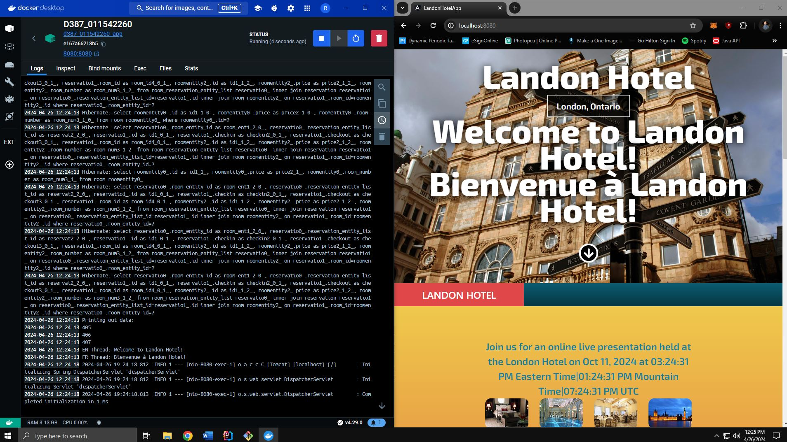

# Assignment:

C. Modify the Landon Hotel scheduling application for localization and internationalization by doing the following:
1. Install the Landon Hotel scheduling application in your integrated development environment (IDE). Modify the Java classes of the application to display a welcome message by doing the following:
    - a. Build resource bundles for both English and French (languages required by Canadian law). Include a welcome message in the language resource bundles.
    - b. Display the welcome message in both English and French by applying the resource bundles using a different thread for each language.
2. Modify the front end to display the price for a reservation in currency rates for U.S. dollars, Canadian dollars (C$), and euros (€) on different lines.
    - Note: It is not necessary to convert the values of the prices.
3. Display the time for an online live presentation held at the Landon Hotel by doing the following:
    - a. Write a Java method to convert times between eastern time (ET), mountain time (MT), and coordinated universal time (UTC) zones.
    - b. Use the time zone conversion method from part C3a to display a message stating the time in all three times zones in hours and minutes for an online, live presentation held at the Landon Hotel. The times should be displayed as ET, MT, and UTC.

D. Explain how you would deploy the Spring application with a Java backend and an Angular frontend to cloud services and create a Dockerfile using the attached supporting document “How to Create a Docker Account” by doing the following:
1. Build the Dockerfile to create a single image that includes all code, including modifications made in parts C1 to C3. Commit and push the final Dockerfile to your repository.
2. Test the Dockerfile by doing the following:
    - Create a Docker image of the current multithreaded Spring application. Run the Docker image in a container and give the container a name that includes D387_[student ID].
    - Submit a screenshot capture of the running application with evidence it is running in the container.

## Deployment description:

For deploying the Dockerized multithreaded Spring application, I would consider using AWS as the cloud service provider.

Firstly, I would make sure that the application is fully Dockerized and works locally as expected. Second, I would log into AWS and set up my an IAMs account by creating an EC2 use case role to launch an EC2 Linux instance. After properly configuring and launching the Linux instance, I can start a session with the Linux instance. I can then use Docker commands to install and start Docker within the instance. Once Docker is properly installed and working within the instance, I can finally login using my Docker credentials to pull my Docker image from Docker Hub and deploy the image in a container.

## Images:

